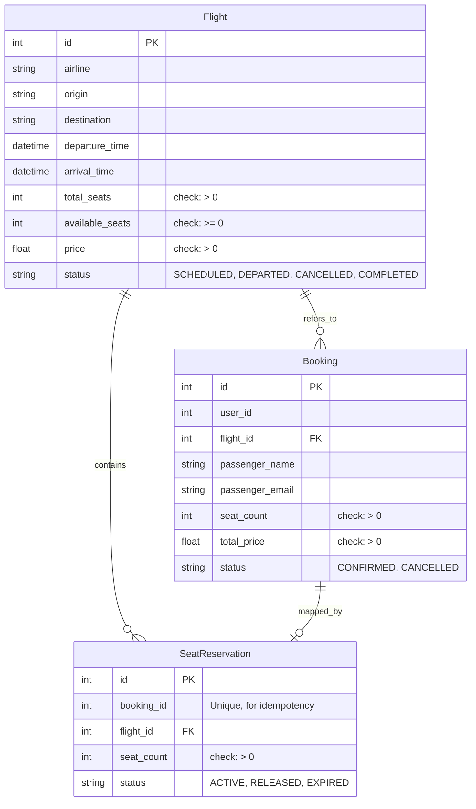

```mermaid
erDiagram
    Flight ||--o{ SeatReservation : contains
    Booking ||--o| SeatReservation : mapped_by
    Flight ||--o{ Booking : refers_to

    Flight {
        int id PK
        string airline
        string origin
        string destination
        datetime departure_time
        datetime arrival_time
        int total_seats "check: > 0"
        int available_seats "check: >= 0"
        float price "check: > 0"
        string status "SCHEDULED, DEPARTED, CANCELLED, COMPLETED"
    }

    SeatReservation {
        int id PK
        int booking_id "Unique, for idempotency"
        int flight_id FK
        int seat_count "check: > 0"
        string status "ACTIVE, RELEASED, EXPIRED"
    }

    Booking {
        int id PK
        int user_id
        int flight_id FK
        string passenger_name
        string passenger_email
        int seat_count "check: > 0"
        float total_price "check: > 0"
        string status "CONFIRMED, CANCELLED"
    }
```
